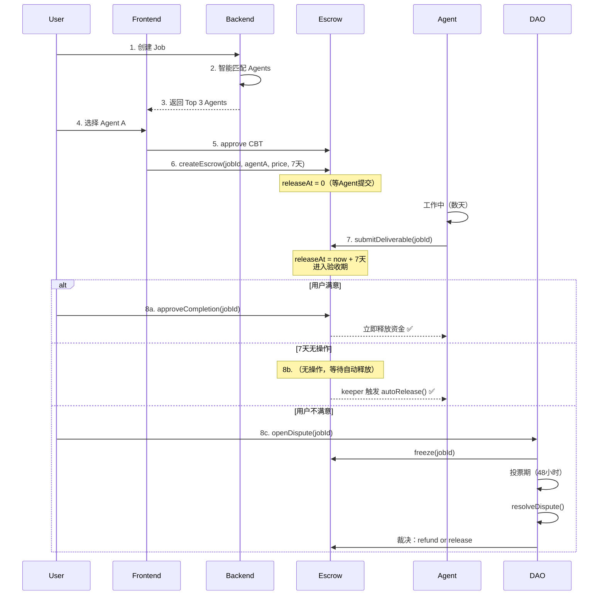

# 智能合约实现分析报告

> 分析时间：2026-01-24
> 合约版本：v1.0
> 分析范围：apps/contract/contracts/*.sol

---

## 📑 目录

- [1. 合约体系架构](#1-合约体系架构)
- [2. 合理性分析](#2-合理性分析)
- [3. 核心业务流程可行性](#3-核心业务流程可行性)
- [4. Keeper 机制详解](#4-keeper-机制详解)
- [5. 问题总结](#5-问题总结)
- [6. 改进方案](#6-改进方案)

---

## 1. 合约体系架构

### 1.1 合约概览

当前实现了 4 个核心合约：

```
┌─────────────┐
│   CBT.sol   │ - ERC20 代币
│  (平台币)   │ - 用户用 ETH 购买
└──────┬──────┘
       │ ETH 收入
       ↓
┌─────────────┐
│ Treasury    │ - 资金池
│  (金库)     │ - 存储手续费
└──────┬──────┘
       │ 服务费
       ↑
┌─────────────┐      冻结/释放      ┌─────────────┐
│  Escrow     │←─────────────────→│ DisputeDAO  │
│  (托管)     │                    │  (争议DAO)  │
└─────────────┘                    └─────────────┘
```

### 1.2 各合约职责

#### **CBT.sol** - 平台代币合约
[contracts/CBT.sol](../../../apps/contract/contracts/CBT.sol)

**核心功能：**
```solidity
- buyWithETH()      // 用户用 ETH 购买 CBT（固定汇率 1:10000）
- pause() / unpause() // 紧急暂停功能
- withdraw()        // Owner 提取 ETH 到 Treasury
```

**设计特点：**
- ✅ 固定汇率，简单透明
- ✅ 收入自动转入 Treasury
- ✅ 支持暂停功能（安全机制）

---

#### **Escrow.sol** - 托管合约
[contracts/Escrow.sol](../../../apps/contract/contracts/Escrow.sol)

**核心数据结构：**
```solidity
struct EscrowInfo {
    address payer;         // 雇主地址
    address agent;         // Agent 地址
    uint128 price;         // 托管金额
    uint128 serviceFee;    // 平台手续费
    uint40 releaseAt;      // 自动释放时间戳
    Status status;         // NONE | LOCKED | RELEASED | REFUNDED | FROZEN
}

mapping(bytes32 => EscrowInfo) public escrows;  // jobId => 托管信息
```

**核心流程：**
```solidity
1. createEscrow(jobId, agent, price)
   - 用户授权 CBT（price + fee）
   - 转账 price 到 Escrow，fee 到 Treasury
   - 设置 releaseAt = now + releaseDelay（默认15分钟）
   - 状态 = LOCKED

2. autoRelease(jobId)  [只能 keeper 调用]
   - 检查时间是否到达 releaseAt
   - 释放资金给 Agent
   - 状态 = RELEASED

3. freeze(jobId)  [只能 dao 调用]
   - 冻结托管（发生争议时）
   - 状态 = FROZEN

4. releaseToAgent(jobId)  [只能 dao 调用]
   - DAO 裁决后释放给 Agent
   - 状态 = RELEASED

5. refundToPayer(jobId)  [只能 dao 调用]
   - DAO 裁决后退款给雇主
   - 状态 = REFUNDED
```

**关键参数：**
- `serviceFeeBps = 200` (2% 平台手续费)
- `releaseDelay = 900` (15分钟自动释放延迟)

---

#### **DisputeDAO.sol** - 争议处理合约
[contracts/DisputeDAO.sol](../../../apps/contract/contracts/DisputeDAO.sol)

**核心数据结构：**
```solidity
struct Dispute {
    uint8 reason;           // 争议原因
    uint40 openedAt;        // 开启时间
    uint128 serviceFee;     // 手续费池（用于奖励投票者）
    uint32 votesFor;        // 支持雇主的票数
    uint32 votesAgainst;    // 支持 Agent 的票数
    uint32 votersCount;     // 总投票人数
    Status status;          // NONE | OPEN | RESOLVED
}

mapping(bytes32 => Dispute) public disputes;  // jobId => 争议信息
```

**投票流程：**
```solidity
1. openDispute(jobId, reason)  [只能雇主调用]
   - 冻结 Escrow 资金
   - 记录手续费金额（用于奖励）
   - 开启投票期（48小时）

2. vote(jobId, supportEmployer)  [任何人可投票]
   - 支付 voteCost (100 CBT)
   - 记录投票权重（基于 CBT 余额）
   - 更新 votesFor / votesAgainst

3. resolveDispute(jobId)  [只能 keeper 调用]
   - 检查投票期是否结束（48小时）
   - 统计结果：votesFor > votesAgainst？
   - 裁决：雇主胜 → 退款；Agent 胜 → 释放

4. claimReward(jobId)  [获胜方投票者领取]
   - 计算奖励 = serviceFee / 获胜方人数
   - 转账 CBT 给投票者
```

**关键参数：**
- `votingPeriod = 2 days` (投票期)
- `voteCost = 100e18` (投票费用 100 CBT)
- `minVoters = 3` (最少投票人数)

---

#### **Treasury.sol** - 资金池合约
[contracts/Treasury.sol](../../../apps/contract/contracts/Treasury.sol)

**核心功能：**
```solidity
- recordServiceFee(jobId, amount)  // Escrow 记录手续费
- releaseReward(jobId, amount, to) // DAO 释放奖励给投票者
- withdrawETH() / withdrawCBT()    // Owner 提取资金
```

**资金流向：**
```
ETH (购买 CBT) → Treasury
   ↓
CBT 手续费 → Treasury
   ↓
投票奖励 → 投票者钱包
```

---

## 2. 合理性分析

### 2.1 ✅ 优点

#### **1. 架构设计清晰**
- 合约职责分离（托管、争议、资金池）
- 符合单一职责原则
- 易于维护和升级

#### **2. 安全性高**
- 使用 OpenZeppelin 标准库（SafeERC20、ReentrancyGuard）
- 角色权限控制（owner、keeper、dao）
- 紧急暂停机制（CBT.pause）

#### **3. Gas 优化良好**
```solidity
// 使用紧凑的数据类型
struct EscrowInfo {
    address payer;      // 20 bytes
    address agent;      // 20 bytes
    uint128 price;      // 16 bytes
    uint128 serviceFee; // 16 bytes
    uint40 releaseAt;   // 5 bytes
    Status status;      // 1 byte
}
// 总计：78 bytes（3个存储槽）
```

#### **4. 事件记录完善**
- 每个关键操作都有事件
- 便于前端监听和数据分析

#### **5. 配置灵活**
- serviceFeeBps 可调整（0-10000）
- releaseDelay 可调整
- voteCost / votingPeriod / minVoters 可配置

---

### 2.2 🚨 关键问题

#### **问题 1：与 PRD 需求不匹配**

**PRD 期望的流程：**
```
Job创建 → 智能匹配Agent → 用户选择 → 资金锁定
  ↓
Agent 工作中（数天）
  ↓
Agent 提交交付物 → 触发7天验收期
  ↓
用户确认 or 自动释放 or 发起争议
```

**当前实现的流程：**
```
createEscrow(jobId, agent, price)
  ↓
立即设置 releaseAt = now + 15分钟  ❌ 不对
  ↓
15分钟后 keeper 触发 autoRelease()  ❌ 太快
```

**差异：**
- ❌ 验收期从创建托管就开始（应该从 Agent 提交交付物开始）
- ❌ 验收期固定 15 分钟（应该是 7 天，且可配置）
- ❌ 没有"Agent 提交交付物"的触发点
- ❌ 没有"用户手动确认完成"的方法

---

#### **问题 2：缺少业务逻辑验证**

**当前代码：**
```solidity
function createEscrow(bytes32 jobId, address agent, uint256 price) external {
    require(agent != address(0));
    require(price > 0);
    require(escrows[jobId].status == Status.NONE);
    // ... 直接创建托管
}
```

**问题：**
- ❌ 合约不验证 `jobId` 是否真实存在（可以用随机 bytes32）
- ❌ 合约不验证 `agent` 是否是注册的 Agent（任何地址都可以）
- ❌ 合约不验证 `price` 是否匹配 Job 预算
- ❌ 合约不验证 `msg.sender` 是否是 Job 的创建者

**风险示例：**
```solidity
// 攻击者可以这样做：
escrow.createEscrow(
    bytes32("fake-job-id"),      // 随机 jobId
    attacker.address,            // 自己的地址
    1000e18                      // 锁定 1000 CBT
);

// 15分钟后
escrow.autoRelease("fake-job-id");  // 资金自动释放给自己？
```

虽然攻击者需要自己支付 CBT，但这暴露了合约缺少业务逻辑验证的问题。

---

#### **问题 3：缺少 Agent 注册机制**

**PRD 期望：**
```solidity
// AgentHiringContract.sol
struct Agent {
    address walletAddress;
    string agentType;
    uint256 ratePerDay;
    bool isActive;
    uint256 totalEarnings;
}

mapping(address => Agent) public agents;
```

**当前状态：**
- Agent 信息只存储在后端数据库
- 合约无法验证 Agent 的真实性
- 无法在链上查询 Agent 历史记录

---

#### **问题 4：验收期逻辑缺失**

| 功能 | PRD 要求 | 当前实现 | 状态 |
|------|---------|---------|------|
| **用户手动确认** | 用户满意后立即释放 | ❌ 无此方法 | 缺失 |
| **超时自动释放** | 7天无操作 → 自动释放 | ✅ 有 `autoRelease()` | 时间错误（15分钟） |
| **Agent 提交触发** | 提交交付物 → 开始验收期 | ❌ 无此方法 | 缺失 |
| **动态验收期** | 根据 Job 配置（7天） | ❌ 固定 15 分钟 | 缺失 |

---

#### **问题 5：DAO 投票机制不完善**

**当前逻辑：**
```solidity
function vote(bytes32 jobId, bool supportEmployer) external {
    uint256 weight = cbt.balanceOf(msg.sender);  // 记录权重

    if (supportEmployer) {
        dispute.votesFor += 1;       // ❌ 实际是 1人1票
    } else {
        dispute.votesAgainst += 1;   // ❌ 没有用 weight
    }
}
```

**问题：**
- ❌ `weight` 字段记录了，但没有生效（计票还是 1人1票）
- ❌ 奖励分配是平均分，没有按权重分配
- ❌ 投票失败方不损失 voteCost（缺少惩罚机制）

**建议改进：**
```solidity
// 改为权重投票
if (supportEmployer) {
    dispute.votesFor += weight;  // 用权重计票
} else {
    dispute.votesAgainst += weight;
}

// 奖励按权重分配
uint256 totalWeight = employerWins ? votesFor : votesAgainst;
rewardPerWeight = serviceFee / totalWeight;
claimAmount = userWeight * rewardPerWeight;
```

---

#### **问题 6：Keeper 单点故障**

**当前设计：**
```solidity
address public keeper;  // 单一 keeper 地址

function autoRelease(bytes32 jobId) external {
    require(msg.sender == keeper, "Unauthorized");  // ❌ 只有这个地址能调用
}
```

**风险：**
- 🔴 如果 keeper 私钥丢失 → 所有订单无法自动释放
- 🔴 如果 keeper 服务器宕机 → 自动化任务停止
- 🔴 如果 keeper 私钥泄露 → 攻击者可以恶意触发释放

**建议：**
```solidity
// 方案A：多 keeper
mapping(address => bool) public keepers;

// 方案B：任何人都可以触发（但只能在时间到了之后）
function autoRelease(bytes32 jobId) external {
    EscrowInfo storage escrow = escrows[jobId];
    require(block.timestamp >= escrow.releaseAt, "Too early");
    _releaseToAgent(jobId, escrow);
}
```

---

## 3. 核心业务流程可行性

### 3.1 流程 1：Job创建 → 智能匹配Agent

**实现方式：** 后端实现

**代码位置：**
- [apps/back-end/src/matching/matching.service.ts](../../../apps/back-end/src/matching/matching.service.ts)

**流程：**
```typescript
MatchingService.match(job, agents)
  ↓
1. hardFilter() - 硬过滤（技能、预算、可见性、支付方式）
  ↓
2. score() - 评分（标签相似度 35%、价格匹配 20%、评分 20%、成功率 15%、响应速度 10%）
  ↓
3. 返回 Top 3 Agents
```

**结论：** ✅ **完全可实现**（纯后端逻辑，不涉及合约）

---

### 3.2 流程 2：Agent被选中 → 用户授权预算 → 资金锁定进Escrow

**前端流程：**
```typescript
// 1. 用户选择 Agent
await jobsService.selectAgent(jobId, agentId);

// 2. 授权 CBT
const price = job.budgetMax;
const fee = price * 0.02;  // 2% 手续费
await cbt.approve(escrowAddress, price + fee);

// 3. 创建托管
await escrow.createEscrow(
    ethers.id(jobId),  // jobId (bytes32)
    agentAddress,      // agent 地址
    price              // 托管金额
);
```

**合约代码：**
```solidity
// Escrow.sol:104
function createEscrow(bytes32 jobId, address agent, uint256 price) external {
    require(agent != address(0));
    require(price > 0);
    require(escrows[jobId].status == Status.NONE);  // 防止重复

    uint256 fee = (price * serviceFeeBps) / 10_000;  // 计算手续费
    uint256 releaseAt = block.timestamp + releaseDelay;  // ⚠️ 立即设置释放时间

    // 转账
    cbt.safeTransferFrom(msg.sender, address(this), price);
    cbt.safeTransferFrom(msg.sender, treasury, fee);

    // 记录托管
    escrows[jobId] = EscrowInfo({
        payer: msg.sender,
        agent: agent,
        price: uint128(price),
        serviceFee: uint128(fee),
        releaseAt: uint40(releaseAt),
        status: Status.LOCKED
    });

    // 记录手续费到 Treasury
    treasury.recordServiceFee(jobId, fee);
}
```

**问题：**
- ❌ 合约不验证 `jobId` 是否真实存在
- ❌ 合约不验证 `agent` 是否是注册的 Agent
- ❌ 合约不验证 `price` 是否匹配 Job 预算
- ⚠️ 验收期立即开始（从 createEscrow 就开始倒计时）

**结论：** 🟡 **可以实现，但缺少业务逻辑验证**

---

### 3.3 流程 3：进入验收期

**PRD 期望：**
```
用户 createEscrow() → 资金锁定
  ↓
Agent 工作中（可能数天）
  ↓
Agent 提交交付物 submitDeliverable() ← 触发验收期
  ↓
进入 7 天验收期（releaseAt = now + 7天）
  ↓
用户可选择：确认 or 争议 or 等待自动释放
```

**当前实现：**
```solidity
// Escrow.sol:116
uint256 releaseAt = block.timestamp + releaseDelay;  // 立即设置为 15 分钟后
```

**流程对比：**
| 阶段 | PRD 期望 | 当前实现 | 问题 |
|------|---------|---------|------|
| 托管创建 | releaseAt = 0（未设置） | releaseAt = now + 15分钟 | ❌ 立即开始倒计时 |
| Agent 工作 | （数天，releaseAt 仍为 0） | （15分钟倒计时中） | ❌ 没有工作期概念 |
| 提交交付物 | submitDeliverable() → releaseAt = now + 7天 | ❌ 无此方法 | ❌ 缺少触发点 |
| 验收期 | 7 天 | 15 分钟 | ❌ 时间错误 |

**结论：** 🔴 **逻辑错误，无法实现 PRD 要求**

---

### 3.4 流程 4：验收通过 → 释放给Agent

**PRD 支持的 3 种方式：**

#### **方式 1：用户手动确认**
```typescript
// 前端
await escrow.approveCompletion(jobId);
```

**当前实现：**
```solidity
❌ 无此方法
```

**影响：**
- 用户即使满意，也无法提前结束验收期
- 只能等 15 分钟后 keeper 触发，或走争议流程

---

#### **方式 2：超时自动释放**
```solidity
// Escrow.sol:150
function autoRelease(bytes32 jobId) external {
    require(msg.sender == keeper, "Unauthorized");  // 只有 keeper 能调用

    EscrowInfo storage escrow = escrows[jobId];
    require(escrow.status == Status.LOCKED);
    require(block.timestamp >= escrow.releaseAt);  // 时间到了

    _releaseToAgent(jobId, escrow);
}
```

**当前实现：**
- ✅ 有自动释放机制
- ❌ 时间是 15 分钟，不是 7 天
- ❌ releaseAt 从创建托管就设置了，不是从提交交付物开始

---

#### **方式 3：争议后释放**
```solidity
// DisputeDAO.sol:169 → Escrow.sol:195
function releaseToAgent(bytes32 jobId) external {
    require(msg.sender == dao, "Unauthorized");
    // ... 释放资金给 Agent
}
```

**当前实现：**
- ✅ 有 DAO 裁决后释放机制
- ✅ 流程完整

**结论：** ⚠️ **缺少用户手动确认，自动释放时间错误**

---

### 3.5 流程 5：发起争议 → 资金冻结 → DAO仲裁

**完整流程：**

#### **步骤 1：雇主发起争议**
```solidity
// DisputeDAO.sol:116
function openDispute(bytes32 jobId, uint8 reason) external {
    address payer = escrow.payerOf(jobId);
    require(msg.sender == payer, "Only payer can dispute");  // ⚠️ 只有雇主

    // 冻结资金
    escrow.freeze(jobId);

    // 记录争议
    disputes[jobId] = Dispute({
        reason: reason,
        openedAt: uint40(block.timestamp),
        serviceFee: escrow.serviceFeeOf(jobId),
        votesFor: 0,
        votesAgainst: 0,
        votersCount: 0,
        status: Status.OPEN
    });
}
```

---

#### **步骤 2：社区投票**
```solidity
// DisputeDAO.sol:137
function vote(bytes32 jobId, bool supportEmployer) external {
    Dispute storage dispute = disputes[jobId];
    require(dispute.status == Status.OPEN);
    require(block.timestamp <= dispute.openedAt + votingPeriod);  // 48小时内

    // 支付投票费用
    cbt.safeTransferFrom(msg.sender, treasury, voteCost);  // 100 CBT

    // 记录投票
    uint256 weight = cbt.balanceOf(msg.sender);  // 计算权重

    if (supportEmployer) {
        dispute.votesFor += 1;  // ❌ 应该是 += weight
    } else {
        dispute.votesAgainst += 1;
    }

    dispute.votersCount += 1;
}
```

---

#### **步骤 3：Keeper 触发结算**
```solidity
// DisputeDAO.sol:169
function resolveDispute(bytes32 jobId) external {
    require(msg.sender == keeper, "Unauthorized");

    Dispute storage dispute = disputes[jobId];
    require(dispute.status == Status.OPEN);
    require(block.timestamp > dispute.openedAt + votingPeriod);  // 投票期结束

    // 统计结果
    bool employerWins = false;
    if (dispute.votersCount < minVoters) {
        employerWins = true;  // 票数不足，雇主胜
    } else if (dispute.votesFor == dispute.votesAgainst) {
        employerWins = true;  // 平票，雇主胜
    } else {
        employerWins = dispute.votesFor > dispute.votesAgainst;
    }

    // 执行裁决
    if (employerWins) {
        escrow.refundToPayer(jobId);  // 退款给雇主
    } else {
        escrow.releaseToAgent(jobId);  // 释放给 Agent
    }

    dispute.status = Status.RESOLVED;
}
```

---

#### **步骤 4：获胜方领取奖励**
```solidity
// DisputeDAO.sol:206
function claimReward(bytes32 jobId) external {
    Dispute storage dispute = disputes[jobId];
    require(dispute.status == Status.RESOLVED);

    // 检查是否已领取
    require(!dispute.claimed[msg.sender], "Already claimed");

    // 检查是否投票且在获胜方
    Vote storage vote = dispute.votes[msg.sender];
    require(vote.voted, "Not voted");

    bool employerWins = escrow.statusOf(jobId) == Status.REFUNDED;
    require(vote.supportEmployer == employerWins, "Not winner");

    // 计算奖励（平均分配）
    uint256 winnersCount = employerWins
        ? dispute.votesFor
        : dispute.votesAgainst;
    uint256 reward = dispute.serviceFee / winnersCount;  // ❌ 应该按权重分配

    // 标记已领取
    dispute.claimed[msg.sender] = true;

    // 从 Treasury 释放奖励
    treasury.releaseReward(jobId, reward, msg.sender);
}
```

**问题：**
- ⚠️ **只有雇主能发起争议**，Agent 无法发起（单向保护）
- ⚠️ **投票是 1人1票**，weight 没有生效
- ⚠️ **奖励平均分配**，没有按权重分配
- ✅ 基本流程完整

**结论：** ✅ **可以实现，但有优化空间**

---

## 4. Keeper 机制详解

### 4.1 什么是 Keeper？

**Keeper = 链下自动化机器人**

智能合约无法自己主动执行，必须有外部账户（EOA）触发。Keeper 就是负责监控链上状态，并在满足条件时触发合约方法的自动化服务。

```
┌─────────────┐
│  Blockchain │
│             │
│  Contract:  │  ← 无法自己执行
│  "如果时间到了，释放资金"
└─────────────┘
       ↑
       │ tx: autoRelease(jobId)
       │
┌──────┴──────┐
│   Keeper    │  ← 链下机器人
│  监控 + 触发  │
└─────────────┘
```

---

### 4.2 当前项目中的 Keeper

#### **Keeper 1：Escrow 自动释放**
```solidity
// Escrow.sol:43
address public keeper;  // keeper 地址

// Escrow.sol:150
function autoRelease(bytes32 jobId) external {
    require(msg.sender == keeper, "Unauthorized");  // 只有 keeper 能调用

    EscrowInfo storage escrow = escrows[jobId];
    require(escrow.status == Status.LOCKED);
    require(block.timestamp >= escrow.releaseAt);  // 时间到了

    _releaseToAgent(jobId, escrow);  // 释放资金
}
```

**Keeper 的任务：**
1. 每 5 分钟扫描数据库中 `status = "IN_PROGRESS"` 的 Job
2. 检查 `reviewEndsAt` 是否 `<= now`
3. 调用 `escrow.autoRelease(jobId)`
4. 更新数据库状态为 `"COMPLETED"`

---

#### **Keeper 2：DAO 争议结算**
```solidity
// DisputeDAO.sol:61
address public keeper;

// DisputeDAO.sol:169
function resolveDispute(bytes32 jobId) external {
    require(msg.sender == keeper, "Unauthorized");

    Dispute storage dispute = disputes[jobId];
    require(dispute.status == Status.OPEN);
    require(block.timestamp > dispute.openedAt + votingPeriod);  // 投票期结束

    // 统计并执行裁决
    // ...
}
```

**Keeper 的任务：**
1. 每小时扫描数据库中 `status = "OPEN"` 的 Dispute
2. 检查 `votingEndsAt` 是否 `<= now`
3. 调用 `dao.resolveDispute(jobId)`
4. 更新数据库状态为 `"RESOLVED"`

---

### 4.3 Keeper 的实现方式

#### **方式 1：手动 Keeper（开发测试）**
```bash
# 管理员手动调用
cast send $ESCROW_ADDRESS "autoRelease(bytes32)" $JOB_ID \
  --private-key $KEEPER_PRIVATE_KEY
```

**优点：** 简单
**缺点：** 不可靠，需要人工执行

---

#### **方式 2：定时脚本 Keeper（推荐用于 MVP）**

```typescript
// keeper/src/index.ts
import { ethers } from "ethers";
import cron from "node-cron";
import { PrismaClient } from "@prisma/client";

const prisma = new PrismaClient();
const provider = new ethers.JsonRpcProvider(process.env.RPC_URL);
const keeperWallet = new ethers.Wallet(process.env.KEEPER_PRIVATE_KEY, provider);
const escrow = new ethers.Contract(ESCROW_ADDRESS, ABI, keeperWallet);
const dao = new ethers.Contract(DAO_ADDRESS, ABI, keeperWallet);

// 每 5 分钟执行一次
cron.schedule('*/5 * * * *', async () => {
    console.log("🤖 Keeper running...");

    // ===== 任务 1：自动释放托管 =====
    const jobsToRelease = await prisma.job.findMany({
        where: {
            status: "IN_PROGRESS",
            reviewEndsAt: { lte: new Date() }  // 验收期已结束
        }
    });

    for (const job of jobsToRelease) {
        try {
            const jobId = ethers.id(job.id);
            const tx = await escrow.autoRelease(jobId, { gasLimit: 200000 });
            await tx.wait();

            console.log(`✅ Released job ${job.id}`);

            await prisma.job.update({
                where: { id: job.id },
                data: { status: "COMPLETED" }
            });
        } catch (error) {
            console.error(`❌ Failed to release job ${job.id}:`, error);
        }
    }

    // ===== 任务 2：结算争议 =====
    const disputesToResolve = await prisma.dispute.findMany({
        where: {
            status: "OPEN",
            votingEndsAt: { lte: new Date() }
        }
    });

    for (const dispute of disputesToResolve) {
        try {
            const jobId = ethers.id(dispute.jobId);
            const tx = await dao.resolveDispute(jobId, { gasLimit: 300000 });
            await tx.wait();

            console.log(`⚖️ Resolved dispute ${dispute.id}`);

            await prisma.dispute.update({
                where: { id: dispute.id },
                data: { status: "RESOLVED" }
            });
        } catch (error) {
            console.error(`❌ Failed to resolve dispute ${dispute.id}:`, error);
        }
    }
});

// 启动
console.log("🚀 Keeper started");
```

**部署方式：**
```bash
# 使用 PM2 保持运行
pm2 start keeper/dist/index.js --name "escrow-keeper"
pm2 logs escrow-keeper
pm2 restart escrow-keeper
```

**优点：**
- ✅ 自动化
- ✅ 可靠（PM2 自动重启）
- ✅ 易于维护

**缺点：**
- ❌ 需要维护服务器
- ❌ Keeper 钱包需要有 ETH 支付 Gas
- ❌ 单点故障（服务器宕机 → 自动化停止）

---

#### **方式 3：Chainlink Automation（生产环境推荐）**

```solidity
// 改造合约支持 Chainlink Automation
import "@chainlink/contracts/src/v0.8/automation/AutomationCompatible.sol";

contract EscrowWithChainlink is Escrow, AutomationCompatible {
    // Chainlink 定期调用此方法检查是否需要执行任务
    function checkUpkeep(bytes calldata /* checkData */)
        external
        view
        override
        returns (bool upkeepNeeded, bytes memory performData)
    {
        // 扫描需要释放的订单（示例）
        bytes32[] memory jobIds = new bytes32[](10);
        uint256 count = 0;

        // TODO: 遍历所有托管，找出 releaseAt <= now 的订单
        // （需要维护一个 jobIds 数组）

        if (count > 0) {
            return (true, abi.encode(jobIds, count));
        }
        return (false, "");
    }

    // Chainlink 自动调用此方法执行任务
    function performUpkeep(bytes calldata performData) external override {
        (bytes32[] memory jobIds, uint256 count) = abi.decode(
            performData,
            (bytes32[], uint256)
        );

        for (uint i = 0; i < count; i++) {
            _releaseToAgent(jobIds[i]);
        }
    }
}
```

**使用步骤：**
1. 访问 https://automation.chain.link/
2. 注册 Upkeep（充值 LINK 代币）
3. 指定合约地址
4. Chainlink 网络自动执行

**优点：**
- ✅ 去中心化（不依赖自己的服务器）
- ✅ 高可靠性（Chainlink 网络保证）
- ✅ Gas 费由 Chainlink 预付（从 LINK 余额扣除）

**缺点：**
- ❌ 需要支付 Chainlink 服务费（LINK 代币）
- ❌ 需要改造合约（增加 `checkUpkeep` / `performUpkeep`）

---

#### **方式 4：允许任何人触发（最去中心化）**

```solidity
// 移除 keeper 限制
function autoRelease(bytes32 jobId) external {
    EscrowInfo storage escrow = escrows[jobId];
    require(escrow.status == Status.LOCKED, "Invalid status");
    require(block.timestamp >= escrow.releaseAt, "Too early");  // 只检查时间

    _releaseToAgent(jobId, escrow);

    // 可选：给触发者一点奖励（激励机制）
    // cbt.transfer(msg.sender, 10e18);  // 奖励 10 CBT
}
```

**优点：**
- ✅ 完全去中心化
- ✅ 无单点故障
- ✅ 任何人都可以触发（包括 Agent 自己）

**缺点：**
- ❌ 依赖第三方主动触发（可能延迟）
- ❌ 如果没有人触发，资金永远锁定

---

### 4.4 Keeper 的风险

#### **风险 1：私钥泄露**
```solidity
address public keeper;  // 0x123...
```

如果 keeper 私钥泄露，攻击者可以：
- 提前触发 `autoRelease()`（在 releaseAt 之前）❌ 已有时间检查，无法提前
- 恶意触发 `resolveDispute()`（在投票期未结束时）❌ 已有时间检查，无法提前
- 但是可以抢先触发（在应该触发的时间点）✅ 影响不大

**实际影响：** 🟡 中等（无法作恶，但可以抢先触发）

---

#### **风险 2：私钥丢失**
```solidity
require(msg.sender == keeper, "Unauthorized");
```

如果 keeper 私钥丢失：
- 🔴 所有订单无法自动释放（永远锁定）
- 🔴 所有争议无法结算（永远无法领取奖励）

**实际影响：** 🔴 严重（资金永久锁定）

---

#### **风险 3：服务器宕机**
如果 keeper 服务器宕机：
- 🟡 订单无法及时释放（延迟）
- 🟡 争议无法及时结算（延迟）

**实际影响：** 🟡 中等（影响用户体验）

---

### 4.5 改进建议

#### **改进 1：支持多 keeper**
```solidity
mapping(address => bool) public keepers;

function addKeeper(address keeper) external onlyOwner {
    keepers[keeper] = true;
}

function autoRelease(bytes32 jobId) external {
    require(keepers[msg.sender], "Not authorized keeper");
    // ...
}
```

---

#### **改进 2：允许任何人触发（但只能在时间到了之后）**
```solidity
function autoRelease(bytes32 jobId) external {
    EscrowInfo storage escrow = escrows[jobId];
    require(block.timestamp >= escrow.releaseAt, "Too early");  // 只检查时间
    _releaseToAgent(jobId, escrow);
}
```

---

#### **改进 3：迁移到 Chainlink Automation**
- 去中心化
- 高可靠性
- 无需维护 keeper 服务器

---

## 5. 问题总结

### 5.1 核心流程可行性评分

| 流程 | 可实现性 | 评分 | 关键问题 |
|------|---------|------|---------|
| 1. 匹配 Agent | ✅ 完全可行 | ⭐⭐⭐⭐⭐ | 后端已实现 |
| 2. 锁定资金 | 🟡 可实现但有风险 | ⭐⭐⭐ | 缺少业务验证 |
| 3. 验收期 | 🔴 逻辑错误 | ⭐⭐ | 时间固定，触发点错误 |
| 4. 释放资金 | ⚠️ 部分可实现 | ⭐⭐ | 缺少用户手动确认 |
| 5. 争议仲裁 | ✅ 基本可行 | ⭐⭐⭐⭐ | 细节可优化 |

**总体评分：** ⭐⭐⭐ / ⭐⭐⭐⭐⭐

**结论：** 🟡 **基本可行，但验收期逻辑需要重大修改**

---

### 5.2 必须修复的问题（P0）

#### **1. 添加用户手动确认方法**
```solidity
function approveCompletion(bytes32 jobId) external {
    EscrowInfo storage escrow = escrows[jobId];
    require(msg.sender == escrow.payer, "Only payer can approve");
    require(escrow.status == Status.LOCKED, "Invalid status");
    _releaseToAgent(jobId, escrow);
}
```

**影响：** 用户可以提前结束验收期 ✅

---

#### **2. 添加 Agent 提交交付物触发点**
```solidity
function submitDeliverable(bytes32 jobId) external {
    EscrowInfo storage escrow = escrows[jobId];
    require(msg.sender == escrow.agent, "Only agent can submit");
    require(escrow.status == Status.LOCKED, "Invalid status");
    require(escrow.releaseAt == 0, "Already submitted");

    // 触发验收期
    escrow.releaseAt = uint40(block.timestamp + releaseDelay);
    emit AutoReleaseScheduled(jobId, escrow.releaseAt);
}
```

**改进流程：**
```
createEscrow() → releaseAt = 0（未设置）
  ↓
Agent 工作中...
  ↓
submitDeliverable() → releaseAt = now + 7天
  ↓
进入验收期
```

---

#### **3. 支持动态验收期**
```solidity
function createEscrow(
    bytes32 jobId,
    address agent,
    uint256 price,
    uint256 customReleaseDelay  // 新增参数
) external {
    // 不立即设置 releaseAt，等 submitDeliverable() 触发
    escrows[jobId] = EscrowInfo({
        payer: msg.sender,
        agent: agent,
        price: uint128(price),
        serviceFee: uint128(fee),
        releaseAt: 0,  // 改为 0
        status: Status.LOCKED
    });

    // 存储自定义延迟（需要新增字段）
    customDelays[jobId] = customReleaseDelay;
}
```

**前端调用：**
```typescript
const releaseDelay = job.reviewWindowDays * 24 * 60 * 60;  // 7天 = 604800秒
await escrow.createEscrow(jobId, agentAddress, price, releaseDelay);
```

---

#### **4. 允许 Agent 发起争议**
```solidity
function openDispute(bytes32 jobId, uint8 reason) external {
    address payer = escrow.payerOf(jobId);
    address agent = escrow.agentOf(jobId);

    // 改为：雇主或 Agent 都可以发起
    require(
        msg.sender == payer || msg.sender == agent,
        "Only payer or agent can dispute"
    );

    escrow.freeze(jobId);
    // ...
}
```

---

### 5.3 重要改进（P1）

#### **5. 改进 DAO 权重投票**
```solidity
function vote(bytes32 jobId, bool supportEmployer) external {
    uint256 weight = cbt.balanceOf(msg.sender);

    if (supportEmployer) {
        dispute.votesFor += weight;  // 改为权重投票
    } else {
        dispute.votesAgainst += weight;
    }
}

function claimReward(bytes32 jobId) external {
    // 按权重分配奖励
    uint256 totalWeight = employerWins ? dispute.votesFor : dispute.votesAgainst;
    uint256 reward = (dispute.serviceFee * userWeight) / totalWeight;
    // ...
}
```

---

#### **6. 添加业务逻辑验证**

**方案 A：链下验证（后端）**
```typescript
// jobs.controller.ts
async createEscrow(jobId: string, agentId: string) {
    // 1. 验证 Job 存在
    const job = await prisma.job.findUnique({ where: { id: jobId } });
    if (!job) throw new Error("Job not found");

    // 2. 验证 Agent 存在且被选中
    const agent = await prisma.agent.findUnique({ where: { id: agentId } });
    if (!agent) throw new Error("Agent not found");
    if (job.selectedAgentId !== agentId) throw new Error("Agent not selected");

    // 3. 验证用户是 Job 创建者
    if (job.userId !== req.user.id) throw new Error("Unauthorized");

    // 4. 调用合约
    await escrow.createEscrow(jobId, agent.walletAddress, job.budgetMax);
}
```

**方案 B：链上验证（推荐）**
```solidity
// 新增 JobRegistry 合约
contract JobRegistry {
    struct Job {
        address creator;
        address selectedAgent;
        uint256 budget;
        bool exists;
    }

    mapping(bytes32 => Job) public jobs;

    function registerJob(bytes32 jobId, address agent, uint256 budget) external {
        jobs[jobId] = Job({
            creator: msg.sender,
            selectedAgent: agent,
            budget: budget,
            exists: true
        });
    }
}

// Escrow 调用 JobRegistry 验证
function createEscrow(bytes32 jobId, address agent, uint256 price) external {
    Job memory job = jobRegistry.jobs(jobId);
    require(job.exists, "Job not found");
    require(msg.sender == job.creator, "Unauthorized");
    require(agent == job.selectedAgent, "Agent not selected");
    require(price <= job.budget, "Price exceeds budget");

    // ...
}
```

---

#### **7. 改进 Keeper 机制**
```solidity
// 方案A：支持多 keeper
mapping(address => bool) public keepers;

// 方案B：允许任何人触发
function autoRelease(bytes32 jobId) external {
    require(block.timestamp >= escrow.releaseAt, "Too early");
    _releaseToAgent(jobId, escrow);
}

// 方案C：迁移到 Chainlink Automation
// （需要实现 checkUpkeep / performUpkeep）
```

---

## 6. 改进方案

### 6.1 方案 A：快速修复（2-3 天）

**目标：** 最小改动，修复核心问题

**改动：**
1. ✅ 添加 `approveCompletion()` 方法
2. ✅ 添加 `submitDeliverable()` 方法
3. ✅ 支持动态 `releaseDelay`（每个 Job 单独配置）
4. ✅ 允许 Agent 发起争议

**代码量：** 约 100 行

**影响：**
- ✅ 验收期逻辑正确
- ✅ 用户可以手动确认
- ⚠️ 仍缺少业务逻辑验证（可以先用后端验证）

**适用场景：** MVP 快速上线

---

### 6.2 方案 B：完整实现（1-2 周）

**目标：** 完全符合 PRD，安全性高

**改动：**
1. ✅ 方案 A 的所有改动
2. ✅ 新增 `AgentRegistry.sol` 验证 Agent 身份
3. ✅ 新增 `JobRegistry.sol` 管理 Job 生命周期
4. ✅ Escrow 改为只接受授权合约调用
5. ✅ 改进 DAO 权重投票逻辑
6. ✅ 迁移到 Chainlink Automation（可选）

**代码量：** 约 500 行

**影响：**
- ✅ 业务逻辑完整
- ✅ 安全性高
- ✅ 完全去中心化

**适用场景：** 生产环境

---

### 6.3 修复后的完整流程



---

## 7. 总结

### 7.1 当前实现评分

| 维度 | 评分 | 说明 |
|------|------|------|
| **合约安全性** | ⭐⭐⭐⭐⭐ | OpenZeppelin、ReentrancyGuard、安全性高 |
| **代码质量** | ⭐⭐⭐⭐ | 结构清晰，注释完善 |
| **PRD 契合度** | ⭐⭐ | 核心业务逻辑缺失（验收期逻辑错误） |
| **可扩展性** | ⭐⭐⭐ | 角色分离好，但缺少关键合约 |
| **Gas 优化** | ⭐⭐⭐⭐ | 数据类型紧凑，事件设计合理 |

**总体评分：** ⭐⭐⭐ / ⭐⭐⭐⭐⭐

---

### 7.2 能否实现核心流程？

**答案：🟡 基本可行，但需要修复验收期逻辑**

**可实现的功能：**
- ✅ 智能匹配 Agent（后端已实现）
- ✅ 资金托管（Escrow 合约完整）
- ✅ 自动释放（keeper 机制正常）
- ✅ 争议仲裁（DAO 基本可用）

**需要修复的功能：**
- ❌ 验收期逻辑（从创建托管就开始倒计时，应该从提交交付物开始）
- ❌ 用户手动确认（缺少 approveCompletion 方法）
- ❌ 动态验收期（固定 15 分钟，应该支持 7 天）
- ❌ Agent 提交交付物触发点（缺少 submitDeliverable 方法）

---

### 7.3 下一步行动

#### **立即修复（P0）：**
1. 添加 `approveCompletion()` 方法
2. 添加 `submitDeliverable()` 方法
3. 支持动态 `releaseDelay`
4. 允许 Agent 发起争议

#### **重要改进（P1）：**
5. 改进 DAO 权重投票
6. 添加业务逻辑验证（JobRegistry / AgentRegistry）
7. 改进 Keeper 机制（多 keeper 或 Chainlink）

#### **可选优化（P2）：**
8. 支持多支付方式（FREE / PER_TASK / RESULT_BASED）
9. 添加 Agent 性能指标链上记录
10. 迁移到 Chainlink Automation

---

## 附录

### A. 合约文件列表

- [apps/contract/contracts/CBT.sol](../../../apps/contract/contracts/CBT.sol)
- [apps/contract/contracts/Escrow.sol](../../../apps/contract/contracts/Escrow.sol)
- [apps/contract/contracts/DisputeDAO.sol](../../../apps/contract/contracts/DisputeDAO.sol)
- [apps/contract/contracts/Treasury.sol](../../../apps/contract/contracts/Treasury.sol)

### B. 后端实现

- [apps/back-end/src/matching/matching.service.ts](../../../apps/back-end/src/matching/matching.service.ts) - 智能匹配服务
- [apps/back-end/src/jobs/jobs.service.ts](../../../apps/back-end/src/jobs/jobs.service.ts) - Job 管理服务

### C. 前端集成

- [apps/front-end/src/hooks/contracts/useCBT.ts](../../../apps/front-end/src/hooks/contracts/useCBT.ts) - CBT 合约 Hook

---

**报告生成时间：** 2026-01-24
**分析人员：** Claude Code
**版本：** v1.0
